# Dokumentasi Diagram (PlantUML) — Proyek 3

Semua 12 diagram di bawah ini ditulis dalam kode **PlantUML**. Satu situs saja untuk semuanya, tidak perlu Claude atau software tambahan.

## Cara membuka

1. Buka **https://www.planttext.com** (gratis, tanpa akun).
2. Hapus contoh kode bawaan di kotak kiri.
3. Copy salah satu blok kode di bawah (mulai dari `@startuml` sampai `@enduml`), paste ke kotak kiri.
4. Diagram otomatis muncul di kanan.
5. Klik tombol **Refresh** kalau tidak otomatis render, lalu klik ikon **download** di kanan atas hasil gambar untuk simpan sebagai PNG/SVG.

Alternatif resmi: **https://www.plantuml.com/plantuml/uml/** — fungsinya sama, tampilannya saja yang sedikit berbeda.

> **Catatan khusus untuk diagram #10 (Gantt chart):** sintaksnya memakai `@startgantt` (bukan `@startuml`), fitur yang relatif baru. Kalau planttext.com menolak/error, coba buka di **https://www.plantuml.com/plantuml/uml/** — mesinnya biasanya versi lebih baru dan lebih mendukung gantt.

---

## 1. ERD Database

Sembilan tabel inti beserta relasinya (PRD Part 10).

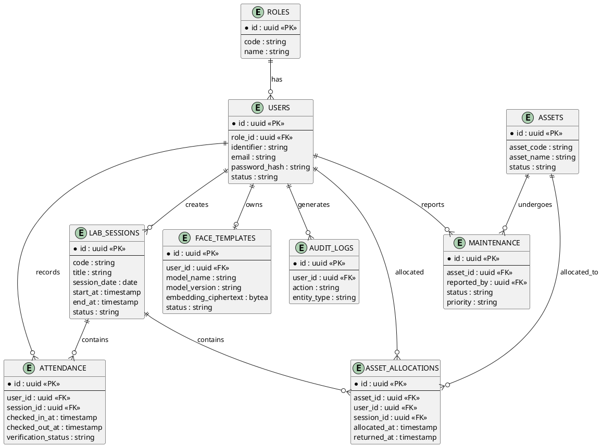

---

## 2. Sequence Diagram — Face Verification 1:1

PRD 6.6: alur verifikasi wajah saat presensi.

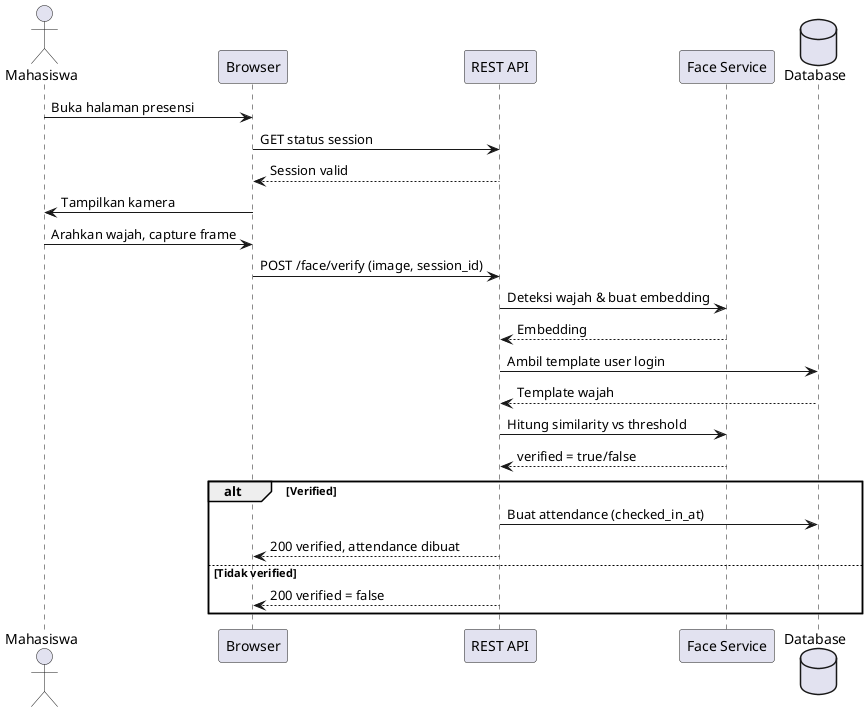

---

## 3. Sequence Diagram — Attendance (Check-in & Check-out)

PRD 7.3–7.5.

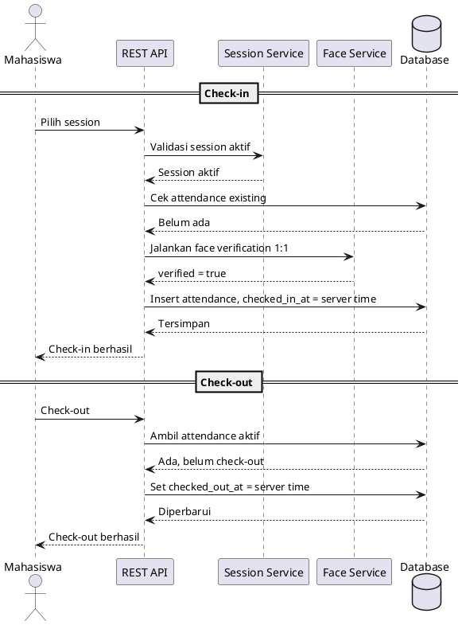

---

## 4. Activity Diagram — Login

PRD 7.1. Ditulis sebagai activity diagram (setara flowchart di PlantUML).

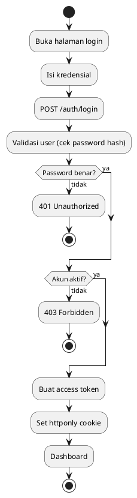

---

## 5. Activity Diagram — Face Enrollment

PRD 7.2. Ada loop retry kalau jumlah wajah terdeteksi tidak tepat satu.

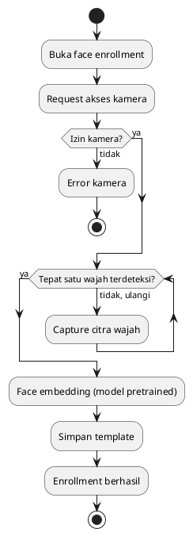

---

## 6. Component Diagram — Architecture (Layered)

PRD Part 8: enam lapisan backend.

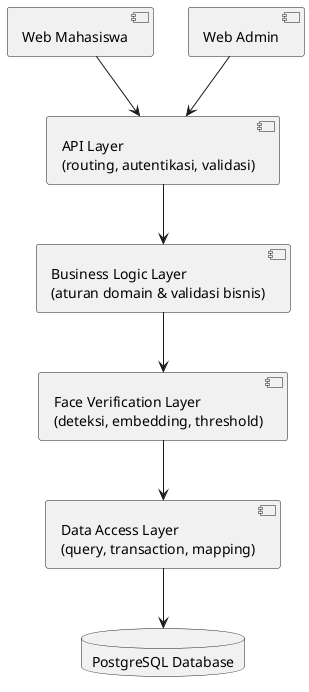

---

## 7. Deployment Diagram

PRD Part 22.

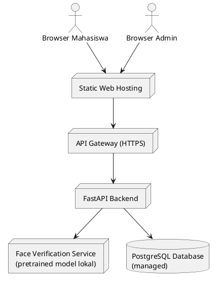

---

## 8. State Diagram — Status Asset

PRD 10.7, 5.10–5.12.

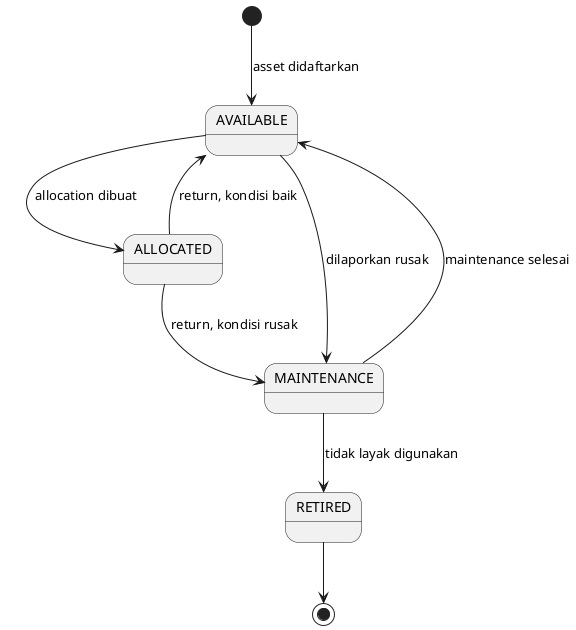

---

## 9. State Diagram — Status Maintenance

PRD 10.9.

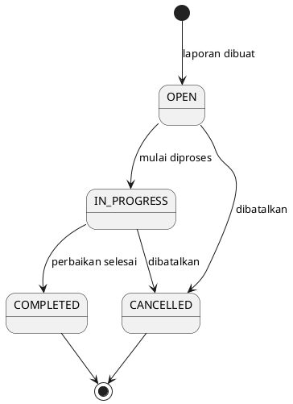

---

## 10. Gantt Chart — Rencana 7 Sprint

PRD 14.9. Tanggal hanya contoh — sesuaikan dengan kalender akademik. **Pakai `@startgantt`, bukan `@startuml`** (lihat catatan di atas kalau error di planttext.com).

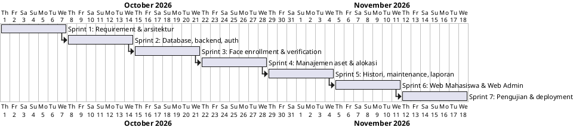

---

## 11. Class Diagram — Backend Service

PRD Part 9: struktur service backend dan ketergantungannya.

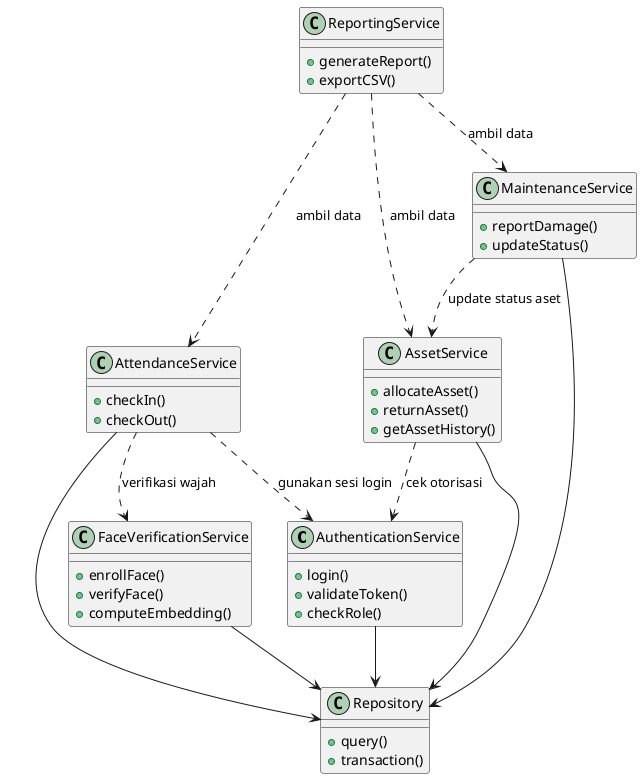

---

## 12. Activity Diagram — Swimlane Presensi

Pembagian tanggung jawab Mahasiswa vs Sistem. PlantUML punya sintaks swimlane native (`|NamaLane|`) — lebih rapi daripada versi gambar tangan sebelumnya.

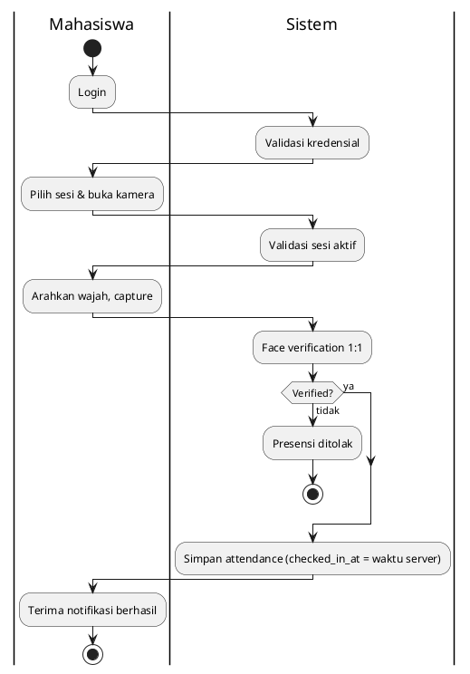

---

*Dibuat untuk Proyek 3 — Keyla S. & Ridwan H.*
